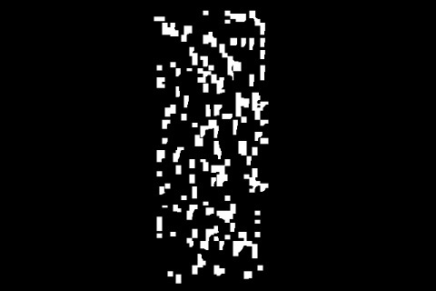

# RockSegmentation
Este projeto utiliza a YOLOv8 para a tarefa de segmentação de pedras claras em uma esteira transportadora de mineração, além disso também foi implementada uma interface utilizando o Vue3.


# Tabela de Conteúdos

# Estrutura do Projeto:
```bash
Yolov8
├── BackEnd                            # Pasta com os componentes backend do projeto
│   ├── app.py                         # Arquivo que realiza a segmentação com a YOLOv8 e cria rotas utilizando o Flask para comunicar com o Vue3
│   │                  
│   └── model                          # Pasta contendo os modelos treinados da YOLOv8 treinados em datasets customizados para segmentação
│       └── best_segment.pt            # Modelo treinado utilizado
│
├── RockSegmentation                   # Pasta com os componentes frontend do projeto
│   ├── src
│   │     ├── components                       # Pasta com os componentes que geram a interface
│   │          └── Area.vue                    # Mostra a área segmentada
│   │          └── FirstPage.vue               # Mostra a tela inicial
│   │          └── MainButton.vue              # Botão para navegar entre as páginas 
│   │          └── MaskedSegmentation.vue      # Mostra a máscara da segmentação
│   │          └── SegmentedRocks.vue          # Mostra o vídeo segmentado
│   │          └── MainComponent.vue           # Arquivo que agreaga os demais componentes
│   │
│   ├──  App.vue    # Arquivo que gera a interface
│   │ 
│   ├── ...                     # Demais arquivos gerados pelo Vue3
│
│
├── requirements.txt                   # dependências utilizadas
│
├── reademe_imgs                       # Pasta para salvar imagens utilizadas no README
│
├── README.md                          # Documentação

```

# Como Executar

1. **Instalar as dependências:**
    - Inicialmente certifique-se de que as dependências necessárias foram instaladas, isso pode ser feito executando o seguinte comando:

       ```bash
       pip install -r requirements.txt
       ```
    - Também é necessário instalar o `Node.js` para poder acessar a interface, isso pode ser feito seguindo o tutorial no link:
        [Instalação do Node.js](https://www.alura.com.br/artigos/como-instalar-node-js-windows-linux-macos#como-instalar-o-node.js)
   
2. **Execução do projeto:**
    - Execute o arquivo `app.py` na pasta BackEnd, então verifique se as rotas foram criadas corretamente:
      1. http://127.0.0.1:5000/video/mask
      2. http://127.0.0.1:5000/video/segmented
      3. http://127.0.0.1:5000/video/area

   - Navegue para a pasta RockSegmentation e execute o comando:
     ```bash
     npm run dev
     ```
     Isso criará o servidor local com a interface
      
   
4. **Interface:**
   - Clique no botão Visualizar Esteira
   - Aguarde alguns segundos
   - Serão exibidas duas janelas, uma contendo o vídeo segmentado, outra contendo a máscara da segmentação, abaixo dessa também será informada a área segmentada em pixels 


# Funcionamento do Código:
Nesta seção iremos apresentar a ideia por trás dos componentes backend e frontend que compôem o código

## Backend
O backend é constituído exclusivamente do arquivo app.py

**app.py:**  Nesse arquivo são inicialmente definidos os caminhos para o caminho do modelo e também do vídeo que desaja-se aplicar a segmentação, tais caminhos são armazenados pelas variávies *model_path* e *video_path*, em segudida é inicializado o modelo da *YOLO* com os pesos informados. O app.py tem três objetivos principais: aplicar a segmentação no vídeo, extrair a máscara da segmentação, calcular a área segmentada. Abaixo vamos discutir o funcionamento das funções utilizadas:

- `get_mask(frame):` Recebe o frame atual do vídeo e então retorna uma máscara binária indicando os pixeis do vídeo que foram segmentados
- `segmented_frames(frame, model):` Faz uma chamada para a função acima, cria uma imagem da cor rosa e então aplica a segmentação aos pixeis do frame que tem valor igual a 1 na mascára

  
*Segmented Frame*

  
*Original Frame*

- `segmented_mask(frame_model):` Também realiza uma chamada para `get_mask()` e então multiplica os valores da máscara por 255, de modo a transformar o pixeis com valor 1 em 255, ou seja, na cor branca. Além disso é calculada a área segmentada, isso é feito calculando o número de pixels com valor igual a 255.

  


- `read_video(video_path, model)`: Essa função processa cada um dos frames do vídeo cujo caminho foi armazenado pela variável *video_path*, para cada um dos frames é feita uma chamada para as funções `segmented_frames()` e `segmented_mask`, retornando assim o frame segmentado, a máscara da segmentação e área da mesma.
- As funções: `generate_segmented_masks()`, `generate_segmented_frames()` e `generate_area()` compartilham da mesma lógica e basicamente geram uma stream de dados que será utilizada em uma das rotas criadas pelo **Flask**
- Já as funões `video_segmented()`, `video_mask()` e `video_area()` são decoradas com `@app.route('/video/...')` de modo a criar um endpoint para cada tipo de fluxo de dados. Quando o frontend faz uma requisição para essas rotas, o Flask executa as funções associadas e retorna o conteúdo gerado pelas funções `generate_segmented_frames()`, `generate_segmented_masks()` e `generate_area()`.

## Frontend
Nos arquivos do frontend iremos abordar apenas aqueles em *RockSegmentation/src/components*, pois os demais são gerados na criação do projeto utilizando o Vue3 e não forma alterados

**1. Area.vue:** Esse componente é responsável por exibir a área segmentada de forma dinâmica. Isso é feito através da leitura contínua dos dados de área enviados pelo servidor local.

**2. FirstPage.vue:**  Página Incial que permite navegar para a página onde são exibidos os vídeos

**3. MainButton.vue:** Botão para navegar entre a página inicial e página que exibe os vídeos

**4. MaskedSegmentation.vue:** Nessa página são capturados os frames da máscara de segmentação enviados ao servidor local pelo Flask, a cada novo frame enviado a imagem é atualizada automaticamente.

**5. SegmentedRocks.vue:** Semelhante ao componente anterior, porém os frames são referentes ao vídeo segmentado.

**6. MainComponent.vue:** Itegra todos os demais componentes, de modo a organizar o conteúdo a ser exibido.


